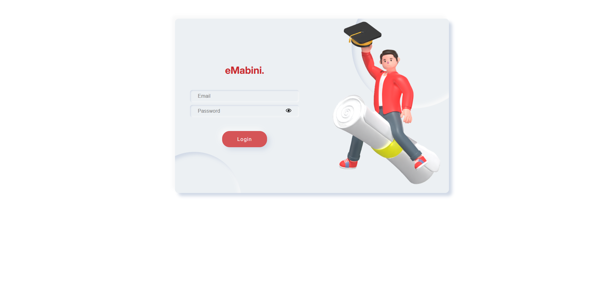
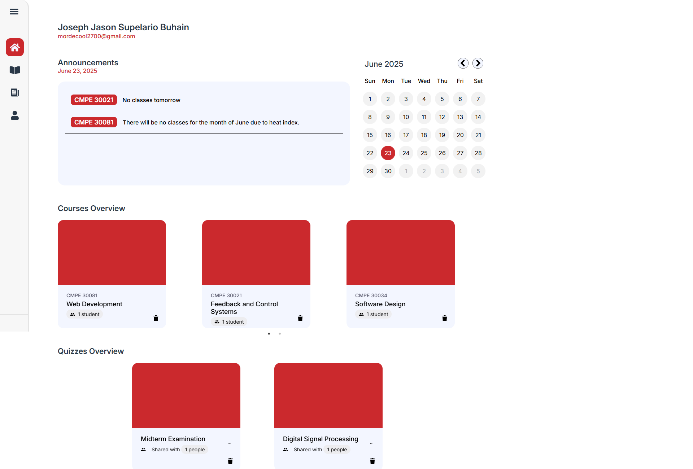
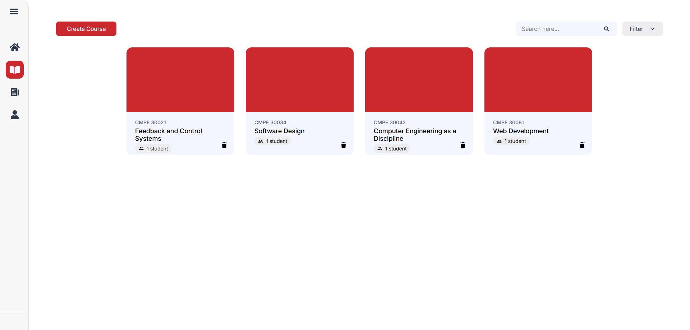
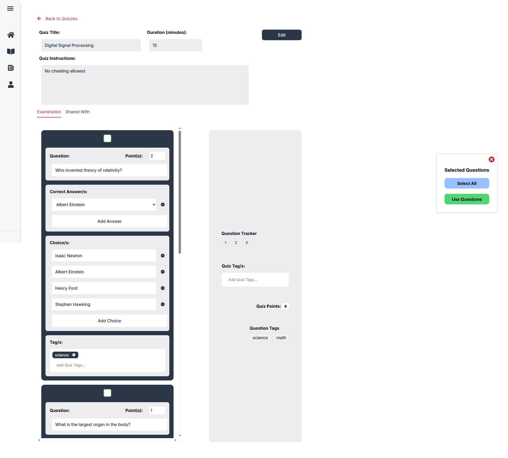
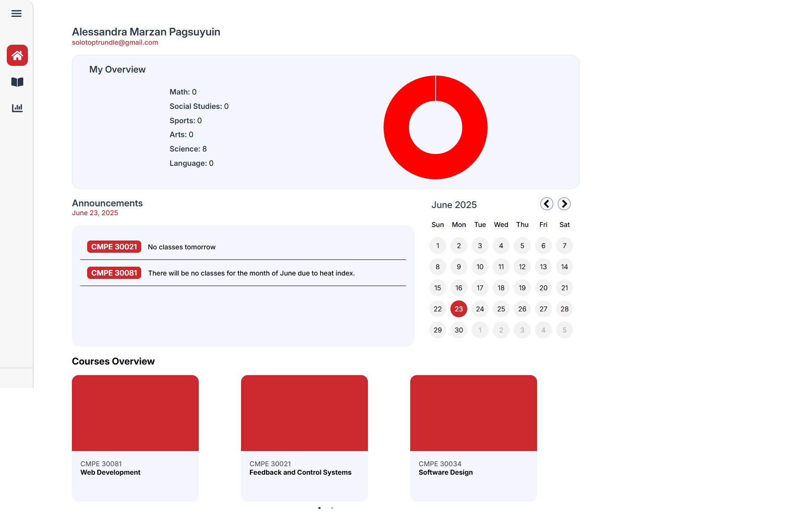
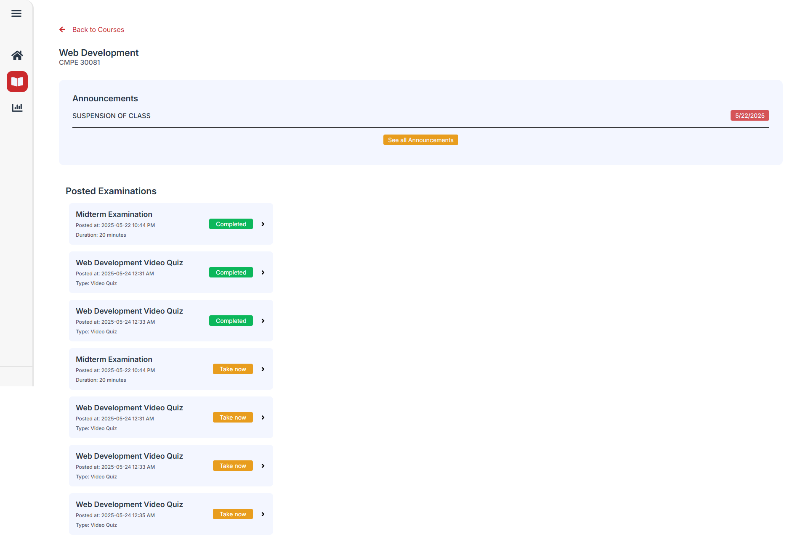
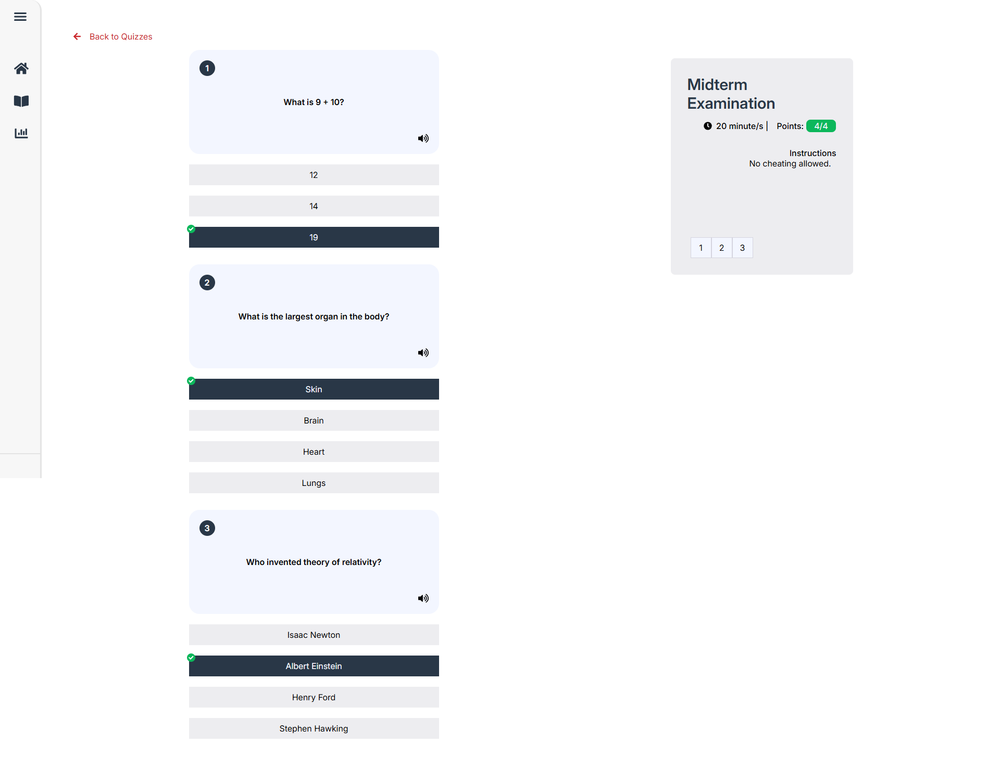

# 📌 eMabini – Learning Management System (Quiz System)

## 🛠 Tech Stack


## 📄 Description

**eMabini** is a modern Learning Management System (LMS) designed to enhance digital education through simplicity, interactivity, and integrity. It offers essential features such as:

- 📚 Course management and student enrollment
- 📝 Interactive quiz maker with video embedding
- 📈 Performance tracking and topic-based progress visualization
- 🛡️ Academic integrity enforcement through tab-exit detection

The platform empowers educators to create personalized learning experiences with reusable assessments and data-driven teaching tools.

## 🚀 How to Use

1. Clone the repository:

   ```bash
   git clone https://github.com/KyneLaggui/emabini-quiz.git
   ```

2. Navigate into the project directory:

   ```bash
   cd emabini-quiz
   ```

3. Install dependencies:

   ```bash
   npm install
   ```

4. Run the development server:

   ```bash
   npm start
   ```

5. Open your browser and visit:
   ```
   http://localhost:3000
   ```

> ⚠️ Ensure you have Node.js and npm installed on your machine before running the project.

## 🤝 Collaborators

| Name                | GitHub                                       |
| ------------------- | -------------------------------------------- |
| Kyne Laggui         | [@KyneLaggui](https://github.com/KyneLaggui) |
| Joseph Jason Buhain | [@joseph27](https://github.com/josephh27)    |

## 🧪 Figma Prototype

[Click here to view the Figma Prototype](https://www.figma.com/design/fo1GYMmz3ynLQFD3NnbjaW/Emabini-Wireframe)

## 🖼 Photo Documentations

| Screenshot                         | Description     |
| ---------------------------------- | --------------- |
|            | Login Page      |
|  | Admin Dashboard |
|  | Course Creation |
|    | Quiz Creation   |
|   | User Dashboard  |
|     | User Courses    |
|        | Quiz System     |

---
